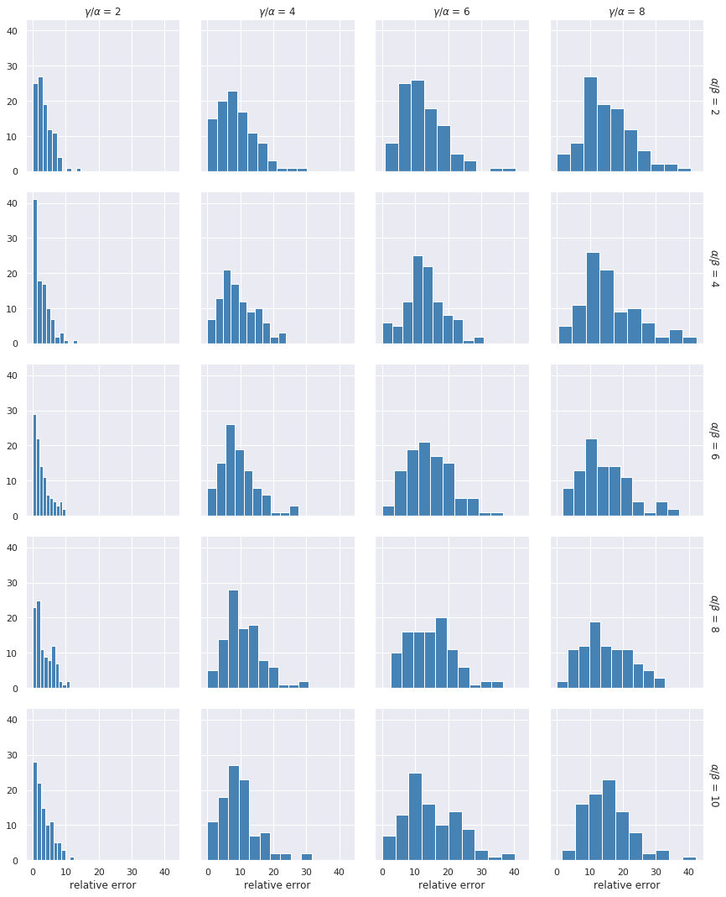
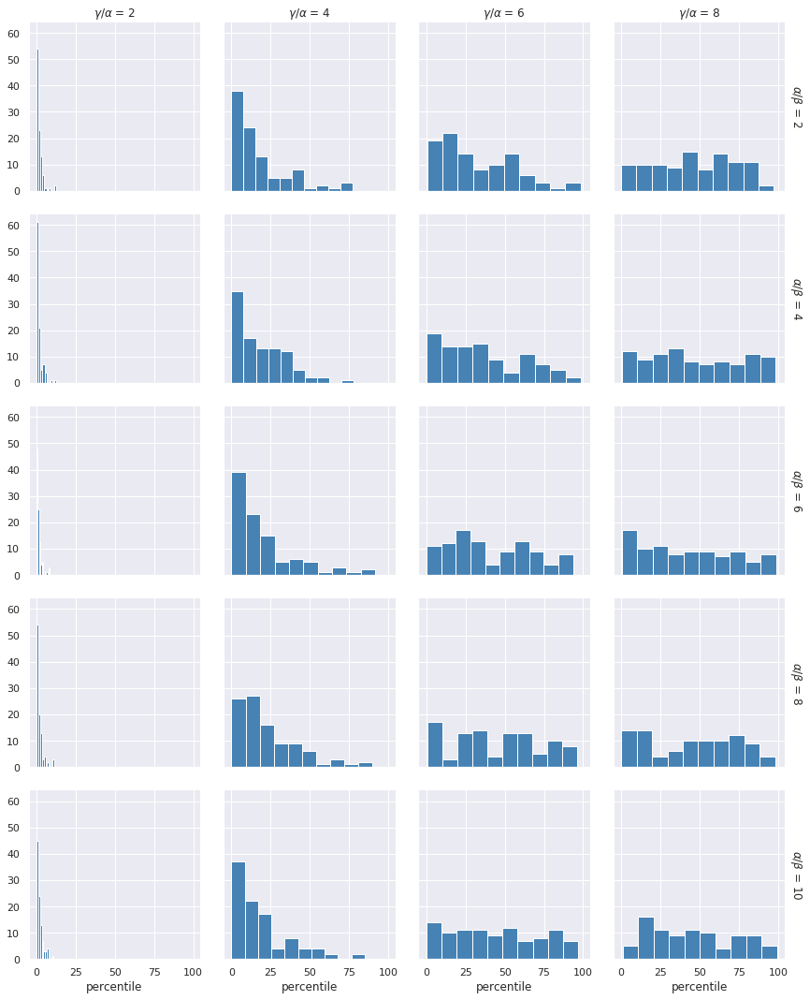

# Report on a second attempt of optimizing constants in TSP model

Report author: Konrad Jałowiecki

## Introduction and recap from the previous report

This report is a follow up to the previous report in this series. For brevity we won't repeat notation introduced there and refer reader to the source.

In the first report we tested the following grid of parameters for solving 7-city TSP problem:

- $`\alpha/\beta`$: 20, 30, 40, 50
- $`\gamma/\beta`$: 2, 4, 6, 8

It was detected that none of the combination of parameters from the above grid gives reasonable results. In fact the results seemed to produce samples with energy distributions being almost uniform. We conjectured that this effect is caused by scaling, which combined with relatively low resolution of parameters on physical hardware resulted in making coefficients indistinguishable from one another. The natural step in further investigation is therefore reducing the range of parameters.

## Design of the experiment

We repeated the experiment in the exactly same setup as previously, except the grid of parameters, which this time looked as follows:

- $`\alpha/\beta`$: 2, 4, 6, 8, 10
- $`\gamma/\beta`$: 2, 4, 6, 8

## Results

### Finding feasible solution

The first evidence that reducing range of parameters gives better results is a success rate presented in the table below. We see that for $`\alpha/\beta < 8`$ D-Wave was always able to find a feasible solution.

|$`\alpha/\beta`$    \    $`\gamma/\alpha`$            |   2 |   4 |   6 |   8 |   total |
|:---------------------|----:|----:|----:|----:|--------:|
| 2                    | 100 | 100 | 100 | 100 |     400 |
| 4                    | 100 | 100 | 100 |  96 |     396 |
| 6                    | 100 | 100 | 100 |  93 |     393 |
| 8                    | 100 | 100 | 100 |  93 |     393 |
| 10                   | 100 | 100 | 100 |  89 |     389 |
| total                | 500 | 500 | 500 | 471 |    1971 |

### "Goodness" of solution - analysis of relative errors and percentiles

The plot and table below show distribution of relative errors for each combination of researched ratios. Please notice that X-axis is _not_ synchronized between subplots because of the differences between samples.

|   $`\alpha/\beta`$ |   $`\gamma/\alpha`$ |   mean |   std |   min |   25% |   50% |   75% |   max |
|-----------------:|------------------:|-------:|------:|------:|------:|------:|------:|------:|
|             2 |              2 |   3.19 |  2.60 |  0.00 |  1.48 |  2.66 |  4.63 | 14.60 |
|             2 |              4 |   8.81 |  5.91 |  0.00 |  4.43 |  7.83 | 12.26 | 30.12 |
|             2 |              6 |  12.54 |  6.85 |  0.91 |  7.91 | 11.00 | 16.25 | 40.35 |
|             2 |              8 |  15.21 |  7.41 |  0.00 | 10.31 | 14.51 | 19.51 | 40.62 |
|             4 |              2 |   2.57 |  2.67 |  0.00 |  0.29 |  1.81 |  3.82 | 13.45 |
|             4 |              4 |   9.50 |  5.26 |  0.00 |  5.96 |  8.42 | 13.07 | 23.77 |
|             4 |              6 |  12.88 |  6.19 |  0.00 |  9.31 | 12.63 | 15.66 | 30.71 |
|             4 |              8 |  16.10 |  8.96 |  0.41 | 10.10 | 14.25 | 21.40 | 42.38 |
|             6 |              2 |   2.73 |  2.57 |  0.00 |  0.74 |  1.91 |  3.83 | 10.00 |
|             6 |              4 |   9.47 |  5.62 |  0.00 |  5.75 |  8.46 | 12.74 | 27.48 |
|             6 |              6 |  14.28 |  6.83 |  0.00 |  8.88 | 13.71 | 18.59 | 36.61 |
|             6 |              8 |  14.50 |  7.66 |  1.61 |  8.88 | 13.21 | 17.68 | 37.06 |
|             8 |              2 |   3.26 |  2.71 |  0.00 |  1.44 |  2.38 |  5.27 | 11.25 |
|             8 |              4 |  10.77 |  5.75 |  0.00 |  6.97 | 10.15 | 13.55 | 30.77 |
|             8 |              6 |  14.74 |  6.93 |  2.58 |  9.33 | 14.80 | 18.84 | 36.58 |
|             8 |              8 |  14.89 |  7.35 |  0.00 |  9.15 | 14.21 | 20.24 | 32.79 |
|            10 |              2 |   3.08 |  2.71 |  0.00 |  0.94 |  2.55 |  4.84 | 12.44 |
|            10 |              4 |   9.57 |  5.83 |  0.00 |  5.86 |  8.50 | 12.06 | 31.57 |
|            10 |              6 |  15.00 |  8.27 |  0.00 |  9.05 | 13.63 | 20.80 | 40.17 |
|            10 |              8 |  15.43 |  7.10 |  1.36 | 10.72 | 14.87 | 19.27 | 42.24 |

As you can see, grid points with $`\gamma/\alpha=2`$ outperformed all other combinations. We can get to similar conclusions by looking on percentiles distribution displayed below (note that again X-axis is not synchronized).

|   $`\alpha/\beta`$ |   $`\gamma/\alpha`$ |   mean |   std |   min |   25% |   50% |   75% |   max |
|-----------------:|------------------:|-------:|------:|------:|------:|------:|------:|------:|
|             2 |              2 |   1.70 |  2.05 |  0.00 |  0.56 |  1.11 |  2.22 | 12.50 |
|             2 |              4 |  17.45 | 18.60 |  0.00 |  3.61 | 11.39 | 23.16 | 77.22 |
|             2 |              6 |  32.23 | 24.23 |  0.42 | 11.88 | 26.94 | 50.56 | 98.47 |
|             2 |              8 |  45.71 | 26.08 |  0.00 | 24.10 | 45.28 | 66.28 | 97.22 |
|             4 |              2 |   1.50 |  2.06 |  0.00 |  0.28 |  0.83 |  1.84 | 12.64 |
|             4 |              4 |  18.75 | 15.76 |  0.00 |  5.28 | 14.86 | 28.19 | 77.78 |
|             4 |              6 |  35.92 | 26.12 |  0.00 | 14.69 | 31.53 | 57.74 | 98.61 |
|             4 |              8 |  47.94 | 29.76 |  0.28 | 23.75 | 44.58 | 73.02 | 98.47 |
|             6 |              2 |   1.46 |  1.72 |  0.00 |  0.28 |  0.97 |  1.94 |  8.61 |
|             6 |              4 |  19.39 | 19.87 |  0.00 |  5.14 | 12.08 | 25.62 | 91.67 |
|             6 |              6 |  41.51 | 26.10 |  0.00 | 19.17 | 36.11 | 62.64 | 93.61 |
|             6 |              8 |  42.46 | 29.51 |  0.28 | 16.11 | 40.00 | 64.17 | 98.61 |
|             8 |              2 |   1.85 |  2.22 |  0.00 |  0.52 |  1.11 |  2.40 | 11.39 |
|             8 |              4 |  23.08 | 19.72 |  0.00 |  8.75 | 16.25 | 34.13 | 90.00 |
|             8 |              6 |  44.65 | 27.83 |  0.56 | 22.78 | 42.22 | 65.45 | 96.11 |
|             8 |              8 |  44.95 | 28.66 |  0.00 | 16.11 | 47.78 | 69.44 | 98.06 |
|            10 |              2 |   1.82 |  2.01 |  0.00 |  0.56 |  1.11 |  2.29 | 10.97 |
|            10 |              4 |  18.97 | 18.44 |  0.00 |  5.94 | 12.50 | 24.44 | 85.00 |
|            10 |              6 |  44.22 | 28.54 |  0.00 | 20.49 | 42.57 | 69.38 | 96.94 |
|            10 |              8 |  46.10 | 27.05 |  0.83 | 21.94 | 43.33 | 70.28 | 99.44 |

## Conclusions and recommendations

Considering the gathered results and the experiment's setup here is what I suggest when solving TSP (and most probably VRP):

- setting the cost constant to arbitrary value
- setting the constraint constant to 2-6 times the cost constant, multiplied further by the maximum cost
- setting the chain strength to two times the constraint constant.

