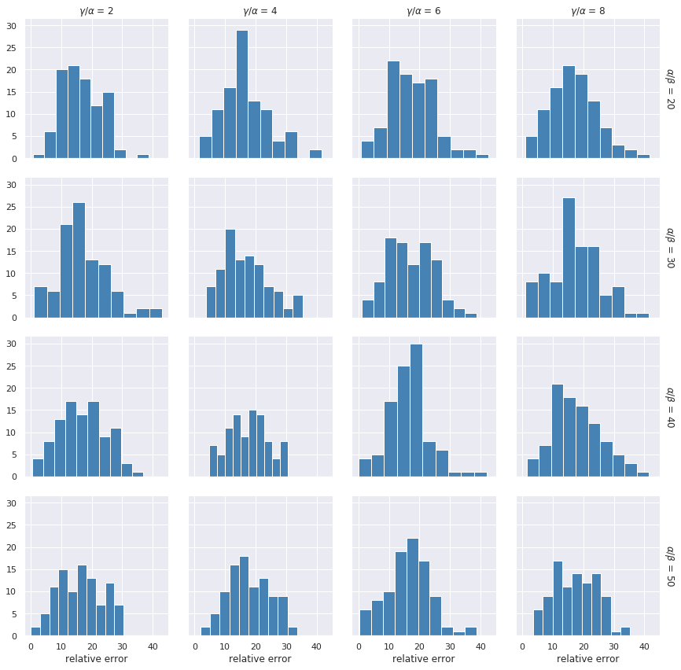
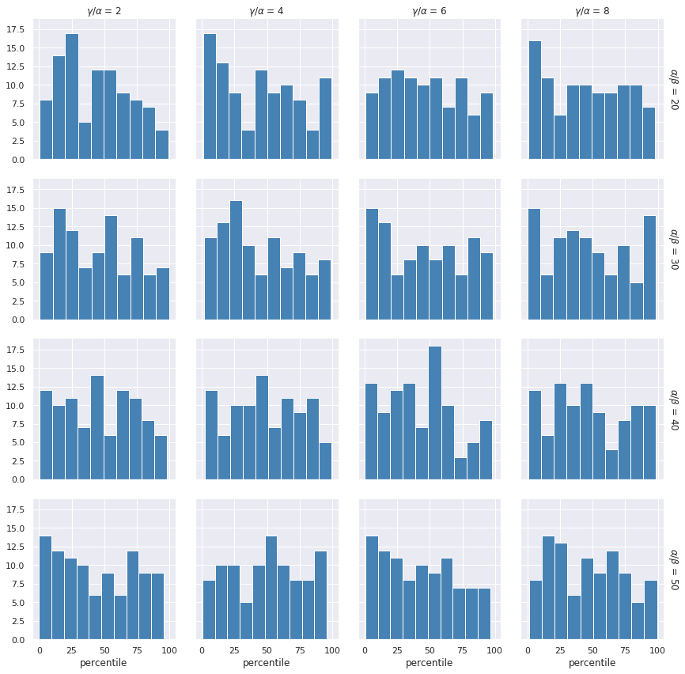

# Report on a first attempt of optimizing constants in TSP model

Report author: Konrad Jałowiecki

## Purpose of the research
The purpose of the research is to determine feasibility regime of constants used in construction of TSP QUBO model. In particular, this report aims to:

- determine domain of ratios of constants used in the model that yields high chance of obtaining any feasible solution. 
- refine and restrict this domain to the one that should give highest quality solution possible.

## Brief discussion of parameters under optimizations

This section describes the parameters of the model. For brevity we are not describing details of construction of the QUBO, as we are most probably already familiar with the construction. The purpose of this section is therefore mainly to establish notation used in the rest of the report.

The QUBO for TSP problem can be conceptually written as a problem of minimizing the following function:

$$
H(\mathbf{q}) =  \alpha H_{\alpha}(\mathbf{q}) + \beta H_{\beta}(\mathbf{q})
$$

where:

- $H_\alpha$ is a part of the function encoding feasibility constraints
- $H_\beta$ is a part of the function encoding cost of the solution.
- $\alpha$ and $\beta$ are positive real numbers that can be thought of as tuning parameters deciding which part of $H$ plays more important role in shaping of the energetic landscape.

It is crucial to note that $H_{\beta}$ is dependent on cost matrix of the problem, which also takes part in shaping of the energetic landscape. However, if the order of magnitude of costs is fixed one might as well neglect this factor and extrapolate results obtained for this order of magnitude to other ranges by (conceptually) rescaling the distance matrix.

From the mathematical point of view the problem does not change if we rescale it by constant positive factor. Instead of thinking about two different parameters we might think about their ratio. This argument is further strenghtened by the fact that on D-Wave's physical hardware the coefficients of QUBO are scaled to fit the range available for the specific QPU, i.e. the problem we are actually solving is rescaled for us anyway.

From the modelling point of view the ratio $\alpha/\beta$ along with the cost matrix are the only factors affecting the energetic landscape. However, due to sparse connectivity of current architecture the problem undergoes minor embedding being solved and the chains of physical qubits are formed to represent a single logical qubit. This comes at a cost of having to introduce additional constant controlling chains strength, which we will call $\gamma$.

The general guideline (refined below) is that one has to choose constraints such that they satisfy the following inequalities $\gamma > \alpha > \beta$. This is because:

- the number 1 priority is to keep chains intact. If that fails we aren't getting any solution (feasible or not) at all. In reallity broken chains can be corrected using e.g. majority voting but at this moment I am not aware of how D-Wave's open source library handles that.
- the second most important thing is to maximize chance of getting feasible solution, i.e. making sure that it is never favourable to break a constraint in order to obtain lower value of cost function.

Let us stress out that the general guidelines outlined above are not only affecting distribution of the solutions, they also decide whether constructed QUBO's low-energy states are actually the ones encoding optimal solution. In other words if we choose the parameters wrong we will fail in solving the problem even given perfecly working quantum annealer. Unfortunately giving precise ranges for which the QUBO is correctly defined is difficult and only some neccesary (not sufficient) conditions are known. Most importantly we have to [obey the follwing inequality](https://arxiv.org/abs/1302.5843):

$$
\beta \cdot \max_{i, j} d_{i,j} < \alpha
$$

where $d_{i, j}$ denotes distance between nodes with indices $i$ and $j$.

## Design of the experiment
Considering remarks from the previous section it was decided to fix the order of magnitude of costs to 1 and perform grid search for the ratios $\alpha/\beta$ and $\gamma/\alpha$. The range used in the experiment were the following:

- $\alpha/\beta$: 20, 30, 40, 50
- $\gamma/\beta$: 2, 4, 6, 8

We acknowledge that the grid defined above is rather coarse grained. However, it was choosen so because of relatively long time required for embedding the problem and obtaining solutions. It was decided to perform more repetitions for every point in grid rather than to search finer grained one without making enough measurements to extract meaningful statistics for each gridpoint.

We choosed 10 randomly generated complete grapss with 7 nodes and tried solving it 10 times for each of the aforementioned grid points which gave as 1600 measurements in total. Each try used 1000 number of reads.

Since the problem we were solving was relatively small it was feasible to bruteforce the optimal solution for the purpose of comparing it to the one obtained by D-Wave. For each successfully computed solution we recorded its:

- relative error with respect to the optimal solution (in terms of total cost)
- percentile at which the obtained solution falled among all feasible solutions. In particular we have choosen strict mode of computed percentiles, meaning that if the optimal solution was found its corresponding percentile should be zero.

The purpose of recording both of the above statistics is as follows:

- relative error measures somehow objective goodness of the solution. This value is most probably of the greatest importance for the end user as it measures the potential overhead of suboptimal solution found.
- percentile measures how many better solutions existed. Large relative error and small percentile may indicate problems with the solver and/or annealing parameters, as it will basically mean that the best solution was not found by the annealer despite its large energy separation from the suboptimal ones.

The cases where the annealer found no feasible solution were not recorded, however those could be deduced from the number of successful tries.

## Results

### Finding feasible solution
At first let us discuss how the constant ratios affected success rate of finding any feasible solution.
The table below shows number of successful tries (per 100) in which any feasible solution has been found by the annealer.

| $\gamma/ \alpha$    \    $\alpha/\beta$       |   2 |   4 |   6 |   8 |   total |
|:---------------------|----:|----:|----:|----:|--------:|
| 20                   |  96 |  97 |  97 |  98 |     388 |
| 30                   |  96 |  97 |  96 |  99 |     388 |
| 40                   |  97 |  95 |  98 |  95 |     385 |
| 50                   |  98 |  95 |  96 |  95 |     384 |
| total                | 387 | 384 | 387 | 387 |    1545 |

We may see that whether the annealer found any feasible solution or not was hardly influenced by the ratios. To rigorously check this observation a two-way $\chi^2$ test has been performed. In the test we obtained test statistics $\chi^2=10.6$ and corresponding $p=0.83$, indicating independence of observed frequencies from both ratios.

### "Goodness" of solution - analysis of relative errors and percentiles.

The plot below shows distribution of relative erros for each combination of researched ratios.

Surprisingly the plot does not show any sign of dependence of relative error on the chosen ratios. Statistics of the relative errors for every pair of ratios are given below. 

|   $\alpha/\beta$ |   $\gamma/\alpha$ |   mean |   std |   min |   25% |   50% |   75% |   max |
|-----------------:|------------------:|-------:|------:|------:|------:|------:|------:|------:|
|               20 |                 2 |  16.61 |  6.60 |  0.70 | 11.89 | 15.95 | 21.47 | 38.69 |
|               20 |                 4 |  16.73 |  7.82 |  1.43 | 11.99 | 14.74 | 21.20 | 41.57 |
|               20 |                 6 |  17.39 |  7.74 |  0.89 | 12.11 | 16.77 | 22.75 | 42.60 |
|               20 |                 8 |  16.75 |  7.83 |  0.89 | 10.91 | 16.34 | 21.42 | 41.63 |
|               30 |                 2 |  17.12 |  7.94 |  1.11 | 12.24 | 16.30 | 21.04 | 42.97 |
|               30 |                 4 |  16.81 |  7.41 |  3.71 | 11.11 | 15.91 | 21.81 | 35.33 |
|               30 |                 6 |  16.93 |  7.61 |  1.07 | 10.59 | 17.00 | 22.56 | 38.67 |
|               30 |                 8 |  17.27 |  8.12 |  1.00 | 12.42 | 16.67 | 22.60 | 41.49 |
|               40 |                 2 |  17.13 |  7.72 |  0.60 | 11.39 | 16.79 | 22.12 | 36.74 |
|               40 |                 4 |  17.55 |  6.59 |  4.68 | 12.60 | 18.01 | 21.93 | 30.62 |
|               40 |                 6 |  16.32 |  6.80 |  0.00 | 12.09 | 16.60 | 19.41 | 42.02 |
|               40 |                 8 |  17.99 |  8.12 |  1.43 | 12.02 | 17.00 | 23.89 | 41.57 |
|               50 |                 2 |  16.47 |  7.38 |  0.00 | 10.24 | 16.56 | 22.50 | 30.44 |
|               50 |                 4 |  17.81 |  6.95 |  1.92 | 12.87 | 16.99 | 22.93 | 33.66 |
|               50 |                 6 |  16.42 |  7.42 |  0.38 | 11.85 | 16.29 | 22.19 | 38.69 |
|               50 |                 8 |  17.47 |  7.18 |  3.56 | 11.29 | 17.40 | 23.24 | 35.33 |

The same can be observed for percentiles, which are shown below.

|   $\alpha/\beta$ |   $\gamma/\alpha$ |   mean |   std |   min |   25% |   50% |   75% |   max |
|-----------------:|------------------:|-------:|------:|------:|------:|------:|------:|------:|
|               20 |                 2 |  43.88 | 26.26 |  0.28 | 21.60 | 45.28 | 64.24 | 99.03 |
|               20 |                 4 |  44.78 | 30.37 |  0.97 | 18.47 | 46.39 | 67.78 | 99.44 |
|               20 |                 6 |  46.84 | 28.01 |  0.83 | 23.33 | 46.11 | 69.44 | 98.61 |
|               20 |                 8 |  45.68 | 29.24 |  0.83 | 17.81 | 41.67 | 70.42 | 98.06 |
|               30 |                 2 |  45.94 | 28.75 |  0.56 | 20.69 | 47.71 | 69.65 | 99.72 |
|               30 |                 4 |  44.12 | 28.25 |  1.67 | 21.39 | 39.44 | 68.75 | 98.89 |
|               30 |                 6 |  45.75 | 30.19 |  0.56 | 14.65 | 42.99 | 69.72 | 98.33 |
|               30 |                 8 |  47.23 | 30.00 |  0.28 | 22.78 | 43.61 | 72.22 | 98.33 |
|               40 |                 2 |  45.98 | 27.95 |  0.28 | 23.06 | 43.89 | 69.17 | 98.33 |
|               40 |                 4 |  48.56 | 27.02 |  2.50 | 23.54 | 46.67 | 71.18 | 99.31 |
|               40 |                 6 |  43.30 | 26.59 |  0.00 | 22.08 | 41.53 | 59.93 | 97.78 |
|               40 |                 8 |  48.19 | 29.17 |  0.83 | 25.00 | 43.61 | 77.22 | 98.61 |
|               50 |                 2 |  43.80 | 29.11 |  0.00 | 17.64 | 40.83 | 70.03 | 95.56 |
|               50 |                 4 |  49.74 | 27.65 |  0.56 | 26.53 | 51.67 | 74.51 | 95.83 |
|               50 |                 6 |  43.02 | 27.95 |  0.56 | 18.96 | 41.04 | 64.97 | 96.39 |
|               50 |                 8 |  46.58 | 27.64 |  1.39 | 21.39 | 46.94 | 68.96 | 99.44 |

## Conclusions
For the analysed grid of parameters we conclude that they hardly affect both success rate of the solution and the solutions's quality.

Success rate was godd almost in every case and only in 55 out of 1000 of tries resulted in no feasible solution being found.

The quality of the solutions leaves much to be desired, the solutions found by D-Wave placed slightly better then half of the all possible solutions on average. Moreover distribution of percentiles and relative errors manifests a lot of uniformity. Most probable cause of this is scaling of the parameters which seems to marginalize coefficients related to cost function.

Overall the above analysis indicates that we should seek improvement by actually reducing $\alpha/\beta$, i.e. the ratio of constraint constant to cost function constant. I suggest performing similar test but for finer grid of parameters with range of $\alpha/beta$ shifted to 10-20 instead 20-50.