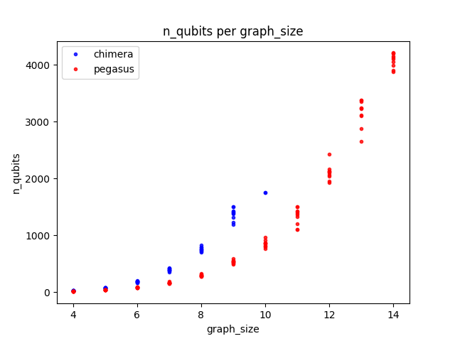
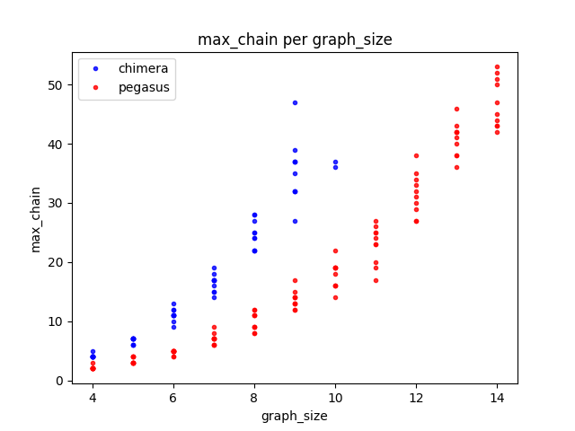
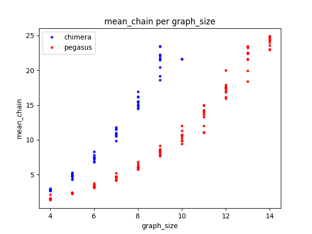

# Evaluation of Pegasus architecture

## Overview

The main goal of this experiment was to check what size of TSP problems will be solvable with the proposed Pegasus architecture and check if there is a difference in the quality of embeddings for TSP and CVRP problems.

It was inspired by the presentation from 11 April 2018, which can be found in the `resources` directory.

## Code 

To generate graphs we used `dwave-networkx==0.6.5`.
To generate embeddings we used `minorminer==0.1.5`.

## Important notes

1. We are not 100% sure if the architectures we used are correct. Chimera architecture seems to be and Pegasus architecture we used is based on the presentation mentioned earlier. However, due to lack of proper documentation we might have made some mistakes here.
2. The next D-Wave machine might turn out to be different from what has been announced (or rather teased) right now.
3. Final graph will probably be a little bit different due to manufacturing errors. 

## Description

We have calculated embeddings for the following problems:

TSP:
- 4 - 15 cities
- Chimera(16, 16, 4) and Pegasus(15)

CVRP:
- 4 - 10 cities
- Chimera(16, 16, 4)
- partition used: [2, problem_size - 3]

Graphs we used were fully connected and created randomly, for each of them we created 10 embeddings.

## Results

In every case we analyzed three parameters:
- number of qubits
- longest chain
- mean lenght of chain

D-Wave uses several physical qubits to encode single logical qubit, and such group of qubits is called "chain". Since every qubit has some probability of error, with longer chains comes higher probability of error being introduced to calculations. Therefore, we want to keep those chains as short as possible.

### Plots

### Observation 1

As can be observed in the plots proposed Pegasus machine is clearly superior to current DWave-2000Q in every dimension we checked. This means, that the calculations should be faster and more accurate.

### Observation 2

The maximum size of problem we will be able to solve with Pegasus architecture will be probably 14 cities.

### Observation 3

There is no additional overhead due to using additional constraints in CVRP over TSP.

### Observation 4

For the graph of size 10, minorminer was sometimes able to find the correct embedding, though not always. This means, that we actually may be able to solve problems of this size on D-Wave 2000Q, given right embedding.

## Conclusion

1. Next generation of D-Wave machine will probably allow to solve TSP problem of size 14 and the quality of solutions for smaller problems should be better than for current machine. 

2. Embeddings of both CVRP and TSP were similar in quality, so any results considering embedding for TSP should generalize well for CVRP.
