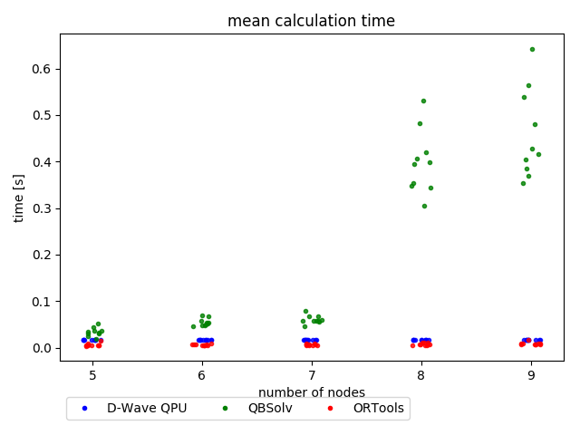
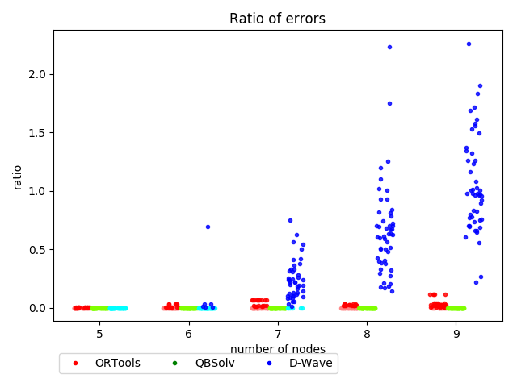
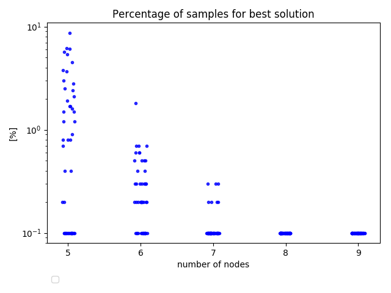
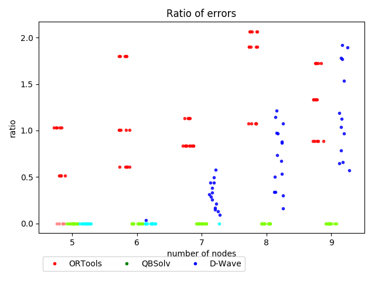

# D-Wave small TSP benchmarks

## Overview

The main goal of this research was to check D-Wave performance on solving TSP in comparison to other methods - ORTools and QBSolv using Tabu search.

## Code 

The exact versions of the libraries used can be found in the `pip_freeze.txt` file in `varia` directory.

The core benchmarking engine was taken from `2018_10_12_benchmark` experiment.

## Description

We have benchmarked three methods of solving TSP problem:
- using D-Wave 2000Q 
- using tabu solver built in QBsolv library
- using ORTools library from Google

The config files used to produced results are in `src/configs` dir.
We tested graphs of size 5 - 9, generated randomly per experiment.

## Results

### Plots

In case of plot with errors, cases where the error was equal to 0 were marked with lighter hue to be more distinguishable from the rest.

More plots can be found in `results` directory.

#### First set of parameters

#### Second set of parameters

### Observation 1

This is based mainly on the `parameters_1_1000.yml` parameters, but it was similar in other cases.

D-Wave QPU time has very small variance - all calculations are performed in almost constant time, ranging from 0.01717s to 0.01724s. The reason for this is that D-Wave has fixed annealing time (which can be adjusted).
On the other han, total time of D-Wave calculations ranged from 1.94s to 14.65s .
This discrepancy probably comes from the following factors:
- classical preprocessing 
- embedding
- web latency
- waiting time

The first two could be definitely optimized on the software side.
Calculation times of other methods (ORTools and QBSolv) have significantly higher variance. For ORTools it's rather constant and for QBSolv it increases with the problem size. However, we have not separated the preprocessing and solving steps there, so it's not fair to draw any strong conclusions concerning the comparison D-Wave QPU time with the others methods.

### Observation 2

In almost all cases ORTools is faster than D-Wave QPU, which in turn is faster than using QBSolv.

### Observation 3

QBSolv was able to find the optimal solution in all (sic!) cases.

### Observation 4

For the first set of parameters, ORTools always found very good solutions. However, when we changed the `edges_magnitude` parameter from 1 to 0, it turned out that it never found good solutions for the graphs of size 6 and bigger. This is result is very perplexing, since we cannot find any explanation for that. 

After changing `edges_magnitude` parameter to 2, ORTools again dealt very well with the problems.

These experiments were done on smaller number of graphs (3 instead of 10), but it's still very puzzling.

### Observation 5

Usually the number of samples with the best solution was equal to 1.
This probably means, that the energy gaps between the lowest energy levels are very small and that the parameters we used were not optimal.

### Observation 6

It's pretty hard to get the parameters right.

## Conclusions

1. Tabu search algorithm implemented in QBSolv works much better than other methods for this problem. It's slightly slower, but always gives correct results.

2. Surprisingly, ORTools cannot solve properly some kinds of graphs. We don't know why.

3. The sole QPU time is very small fraction of the whole D-Wave calculation time. With some software optimization and better access to hardware, we could probably go down with the total D-Wave calculation time.

4. We were not able to show D-Wave superiority over other algorihtms. However, since still a lot more work can be done on finding right parameters, it cannot be excluded.

