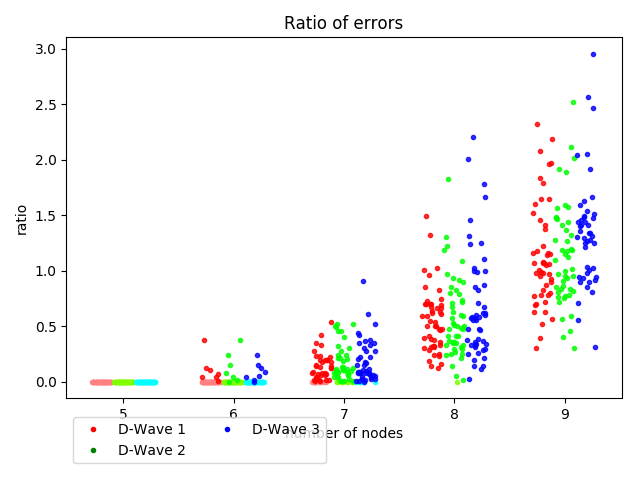
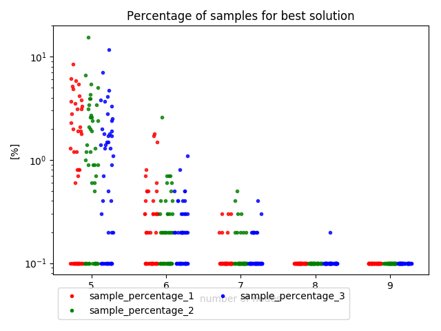

# D-Wave TSP - annealing time

## Overview

The main goal of this research was to check if increasing annealing time leads to better results.

## Code 

Initial code comes from `2018_10_16_benchmark_small_tsp` experiments and was adjusted for this experiment.

## Description

We have benchmarked three values of annealing time:
- Case 1: 20 (default)
- Case 2: 40 
- Case 3: 60

The config files used to produced results are in `src/configs` dir.
We tested graphs of size 5 - 9, generated randomly per experiment.

Later we have repeated these experiment with the following values:
- Case 1: 20 (default)
- Case 2: 200 
- Case 3: 800

Results for this run are in `results/benchmark_20_200_800.csv` file.

## Results

This experiment was intended to be very fast, so the plots could be much prettier. Each case is indicated by number (1, 2 or 3).
These plots are from the first set of parameters. 
There were no significant changes between both sets of parameters.

## Conclusions

Changing the parameter "annealing time" in tested range doesn't influence the results.