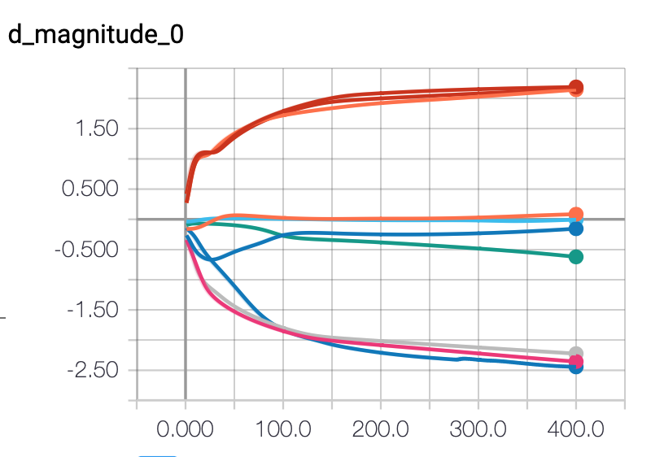
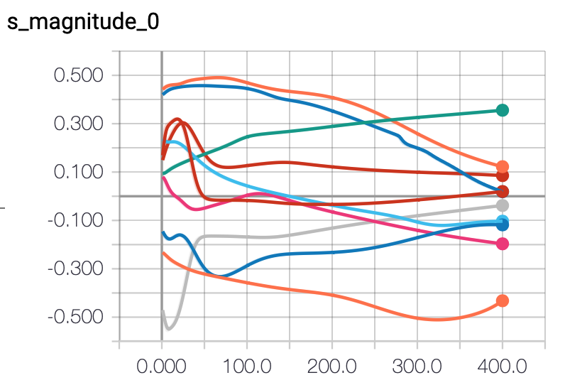
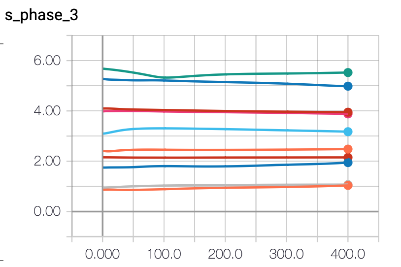

# Yellow Submarine - reproducibility

## Overview

The main goal of this research was to check how similar are consecutive runs of Yellow Submarine - a MaxCut solver. The output of the algorithm is probabilistic, since the parameters are randomly initialized - this might cause the algorithm to converge into very different solutions with every run and hence a huge number of repetitions might be required to achieve a confidence that the results we get are reproducible.

This was also an opportunity to do some initial tests on what are the reasonable values of the algorithm parameters.

## Code 

The main `yellow_submarine` engine comes from https://github.com/BOHRTECHNOLOGY/yellow_submarine, commit hash: `e4d4c16454af4d60843333f3cba8f7e98fa83381`.

The following versions of the libraries has been used:
- qmlt==0.7.1
- StrawberryFields==0.9.0

### Tensorflow problems

Due to some problems with resetting values of tensors in tensorflow, in order to run several consecutive runs, you need to use `runner.py` script instead of `main.py`.

## Description

We have checked how the algorithm behaves between different runs for the same set of parameters.
We have used the following parameters:
```
    c = 3
    A = np.array([[c, 1, 1, 0],
        [1, c, 1, 1],
        [1, 1, c, 1],
        [0, 1, 1, c]])

    interferometer_matrix = \
        np.array(
            [[1, -1, 1, -1],
            [1, 1, 1, 1],
            [-1, -1, 1, 1],
            [1, -1, -1, 1]
            ]) / 2

    learner_params = {
        'task': 'optimization',
        'regularization_strength': 2e-5,
        'optimizer': 'SGD',
        'init_learning_rate': 0.1,
        'log_every': 1,
        'print_log': False
        }

    training_params = {
        'steps': 200,
        'cutoff_dim': 17
        }
```

### Cost function

Two methods of evaluating cost have been used. Method A:

1. Calculate the costs of all possible states
2. Take the probability of all possible states
3. Perform element-wise multiplication of these two arrays
4. Sum over all elements
5. Divide by the sum of all probabilities (normalization)

In method B we limit ourselves only to the states with either 0 or 1 - we ignore all the other states.

Method A corresponds to encoding where 0 in resulting state corresponds to 0 in a solution, and all other numbers to 1.

Method B corresponds to encoding, where 0 and 1 corresponds to 0 and 1. All the states including any other numbers are simply invalid.

### Phase

Displacement and squeeze gates (Dgate and Sgate) have two parameters, which represent a complex number.  If only one value is provided, the phase of this complex number is set to 0.
At first we performed simulations using only one parameter, then we added also a second one. Since the results are very different, below we provide observations for both cases.

## Results 

Unfortunately the files generated during the training process are too big to store them in the repository and we have not found a way to export the results from Tensorboard without a huge manual overhead.
Hence, to see the exact results of the training 


### Observation 1

The results for given set of parameters were very similar - there were some differences in the final result, however they were rather minor. Also, evolution of the parameters was smooth, without any major changes between runs.
Though it is worth noting, that the final value of the cost function differed between runs - i.e. it has not always converged to the same value.

### Observation 2
The training process is very smooth - this is probably due to the methods of cost function used.

Even though these methods works very well, they are not very practical for larger problems and outside of the simulator. There are, however, a couple of reasons for using it in this setup:
- it is an exploratory study.
- if the algorithm will fail with the most accurate value of the loss function, it will probably fail for the less accurate too. If it works, then we experiment with different loss functions.
- in practical setting we would have a set of measurements, which gives us an approximation of the tensor of probabilities of all the states. The more measurements we have, the better approximation we get. Also, we don't need to calculate the costs of all the possible solutions - we only need to evaluate those that we have sampled.

### Observation 3
The value of the cost function was usually converging before reaching 100-th iteration.

### Observation 4
The value of the cost function was lower when method B was used: around -3.8 compared to -3.2. 
After some modifications, which resulted in values (0, 1, 2) being valid (both 1 and 2 was treated as 1), the results were better.
This follows the intution, since the more states we exclude from calculating cost_function, the smaller is the total probability we use.

### Observation 5
Most tests were performed with the `learning_rate=0.1`. However, when it was increased to `1`, there training process was much less smooth and the characteristic oscillations appeared for almost all the parameters.

### Observation 6
Parameters of the Kerr gates were almost always changing extremely slow - at the rate of 0.1 across whole training or slower. This suggests, that these gates don't have much influence on the final result.

### Observation 7
The value of trace was changing throughout the training. It can usually be kept above level of 0.9 with enough regularisation and high enough cutoff value.

### Observation 8

The resulting circuit is always able to find only one (out of two) solutions - in case of the matrix we used it was either [0,1,1,0] or [1,0,0,1].

## Results - with phase

Observation 1 was made after using the same parameters as for the experiments without phase.
All the subsequent observetions were made for 400 steps and learning rate 0.05.

### Observation 1

The overall performance of the training was worse:
- trace was getting into much lower values (sometimes down to 0.4)
- the results was much less similar
- the learning curves were less smooth
- convergence was smaller (200 steps wasn't always enough)

### Observation 2

The parameters of Kerr gates are changing faster than if phase was fixed. But still, these changes are not significant.

### Observation 3

After running learning for 400 iterations and with slightly lower learning rate (0.05) and higher regularization (2e-3) it seems that the loss function is converging in most cases.


### Observation 4 

The 5th step of calculating cost function (normalization) might have an adverse effect on learning. Since we compensate for the probability "leaking" from our system in the loss function, the algorithm has no incentive for avoiding it. Perhaps omitting this step would result in system which is better at conserving total probability.

### Observation 5

Magnitudes of Dgates converge to one of the three values: positive, around 0 or negative - the exact value depends on the gate. 

Magnitudes of Sgates change throught the training, though don't converge to any specific values.

Phases of both Dgates and Sgates, and values of Kgates change slightly throught the training, but don't don't converge to any specific values and at the end of training have values similar as at the beginning.

Examples:






## Conclusions

Based on the results we decided to make the following decisions:
- the following parameters need to be optimized: `init_learning_rate`, `regularization_strength`.
- we will continue treating phase as a parameter for Dgates and Sgates.
- remove normalization step from the cost function and we will use method A.
- 10 repetitions of training process seems to be enough to get a representative sample.
- 200 steps seems to be enough iterations for the algorithm to converge.

The results obtained are interesting and allow us to state some new questions: 
- Which gate layers are really important for the training process
- Does including phase yields any improvement in the training process