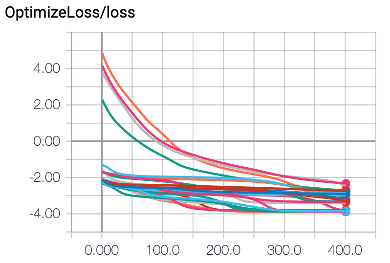
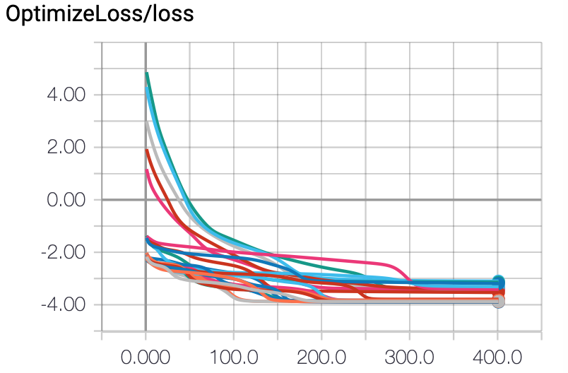
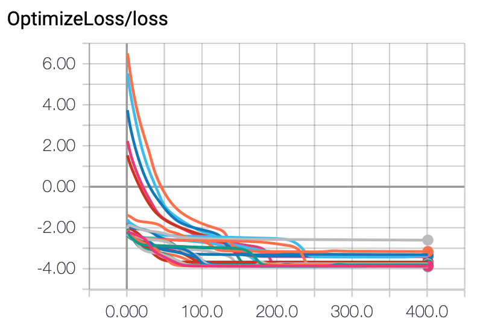

# Yellow Submarine - finding parameters

## Overview

## Code 

The code is continuation of `2019_01_17_check_reproducibility`, commit hash: `aad77a501fbea913503edb14063a570e514e72aa`

The following versions of the libraries has been used:
- qmlt==0.7.1
- StrawberryFields==0.9.0

### Tensorflow problems

Due to some problems with resetting values of tensors in tensorflow, in order to run several consecutive runs, you need to use `runner.py` script instead of `main.py`.

## Description

This experiment can be divided in three phases. The number of runs was limited by the amount of free disk space - each run produces about 250MB of logs.

### Phase 1 - Finding learning rate regime

The aim of this phase was to find in what regime we should look for the values of learning rate. We have tested the following values: [0.002, 0.01, 0.05, 0.25, 1.25, 6.25, 31.25] and performed 3 runs for each of them.

This phase has been performed with a bug in the code. However, we have decided that the bug shouldn't affect the results of this phase much, so we have not repeated it. In the end, th goal is not to find the optimal values of learning rate, but such that work well enough.

### Phase 2 - Finding learning rate and regularization strength values

The aim of this phase was to find the exact values for learning rate and regularization. We have checked the following values of learning rates: [0.05, 0.1, 0.15] and regularization: [1e-5, 1e-4, 1e-3, 1e-2, 1e-1]. We've performed 5 runs for each combination of values.

### Phase 3 - Double checking the results. 

The aim of this phase was to check whether chosen parameters are indeed giving good results by running training with these parameters 10 times.

## Results

### Observation 1

With regularization 0.1 values of the Kerr gates all went down to 0.
With regularization 0.01 they were clearly diminishing over time. 
For smaller values the effect was hard to notice.
The effect was similar, though somewhat less strong, for Sgate phases and even weaker for Dgate phases.

### Observation 2

Trace was well preserved in all the simulations.

### Observation 3

For learning rates below 0.05 training doesn't converge in 400 iterations. For learning rates above 1 training doesn't work tensorflow throws errors - that's probably due to too big values and numerical instability.

For 0.25 the curves are pretty ragged, so the best range for the learning rate seems to be [0.05 - 0.15]

### Observation 4

From the learning rates examined in more details ([0.05, 0.1, 0.15]), 0.1 seems to give the best results.
In case of 0.05 the convergence has sometimes not occured at all, hence the results are much worse.
In case of 0.1 the convergence usually occurs before 200-th iteration and the final results (after 400 steps) are satisfactory - between -4 and -3.
In case of 0.15 the convergence is slightly faster, the trace is slightly lower and the results are pretty much the same.

Below are the plots of the loss function for those parameters (in order):

### Observation 5

Lower values of regularization yielded faster convergence and better results.

### Observation 6

Running the training for the chosen set of parameters (`lr=0.1` and `reg=1e-4`) several times gave satisfying results consistently.

### Conclusion

After analyzing the results of this experiment, we have decided to use the following parameters for further research: learning rate 0.1 and regularization strength 0.0001.