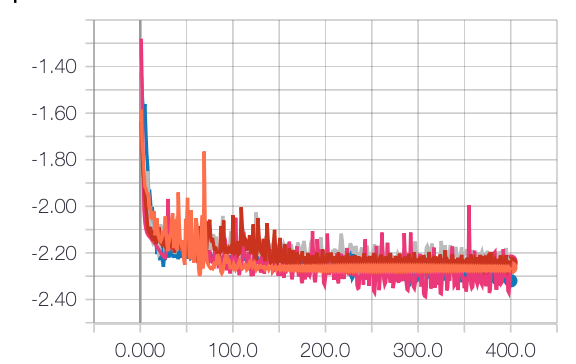
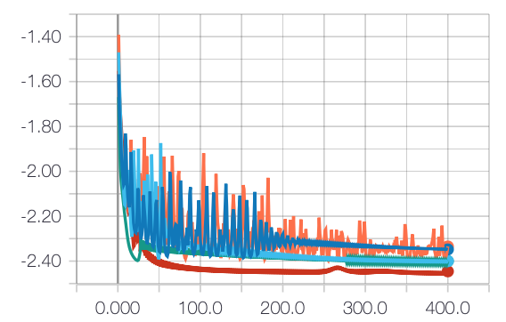

# Yellow Submarine - ML approach

## Overview

In this experiment instead of training the circuit to solve a single graph, we took approach more akin to machine learning: we were training a single network using several different graphs and checking if it generalizes well.

## Code 

The code is built on top of `2019_01_23_investigating_layers`, commit hash: `aad77a501fbea913503edb14063a570e514e72aa`

You can find the versions of the libraries used in this experiment in `requirements.txt` file.
When it comes to `QMLT`, we have used a modified version of it, which has been included in this repository.

### Tensorflow problems

Due to some problems with resetting values of tensors in tensorflow, in order to run several consecutive runs, you need to use `runner.py` script instead of `main.py`.

## Description

The "machine learning" approach works as follows:

1. We pass several graphs (in the form of adjacency matrix) to the solver as input.
2. During every iteration, for every graph, we build a circuit and evaluate it.
3. The cost for given set parameters is sum of costs of outputs of all the created circuits.

We have done the following tests:
1. Using 1 layer and 1st set of graphs
2. Using 1 layer and 2nd set of graphs
3. Using 2 layers and 2nd set of graphs


By 1 layer we mean layer as described in this article: https://arxiv.org/abs/1806.06871. 

Graphs can be found in the appendix at the end of this report.
2nd set of graphs was constructed in such way, that every graph has different solution.

## Results

### Observation 1

For the 1st set of graphs some of the graphs had the same solutions. Hence, it was easy for the system to learn to output this solution regardless of the input matrix. 

### Observation 2

While using 2nd set of graphs, circuits were not able to find an optimal solution - independent of the non-linear gates used (or lack of them) it always learned to return the same results regardless of what graph has been embedded.

### Observation 3

While using 2nd set of graphs and 2 layers, the results were still very similar as for 1 layer. However, the training process was much less smooth.

### Observation 4

Unfortunately time needed to run the code on the hardware available to us increased significantly with adding the second layer, so it is unfeasible for now to test it using more layers.

### Observation 5

The output of the circuit was independent of the embedded graph.


### Observation 6

When used 2 layers, the parameters of the Kerr gates changed significantly during the training. Which is different 

### Observation 7

The best result has been achieved when no non-linear gates has been used - the cost function was lowest and the training was very smooth.
The results with Cubic gates were slightly better than with Kerr gates when it comes to the value of the cost function. In both cases there are oscillations in the cost function (and also in the values of the parameters).





## Conclusions

Proposed algorithm wasn't able to learn solving maxcut problem based on the input state. The results suggest that the input state was not relevant in the training process. Therefore some other methods should be implemented in order to facilitate training and help it generalize better.

## Appendix - graphs

### 1st set of graphs
```
    [[0, 1, 1, 1],
    [1, 0, 1, 1],
    [1, 1, 0, 1],
    [1, 1, 1, 0]]

    [[0, 1, 1, 0],
    [1, 0, 1, 1],
    [1, 1, 0, 1],
    [0, 1, 1, 0]]

    [[0, 0, 1, 0],
    [0, 0, 1, 1],
    [1, 1, 0, 1],
    [0, 1, 1, 0]]

    [[0, 1, 0, 0],
    [1, 0, 1, 0],
    [0, 1, 0, 1],
    [0, 0, 1, 0]]
```

### 2nd set of graphs
```
[[0, 1, 1, 1],
[1, 0, 0, 0],
[1, 0, 0, 0],
[1, 0, 0, 0]]

[[0, 1, 0, 0],
[1, 0, 1, 1],
[0, 1, 0, 0],
[0, 1, 0, 0]]

[[0, 0, 1, 0],
[0, 0, 1, 0],
[1, 1, 0, 1],
[0, 0, 1, 0]]

[[0, 0, 0, 1],
[0, 0, 0, 1],
[0, 0, 0, 1],
[1, 1, 1, 0]]
```